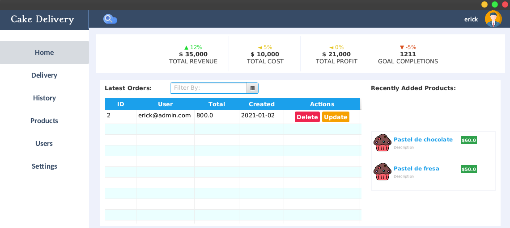
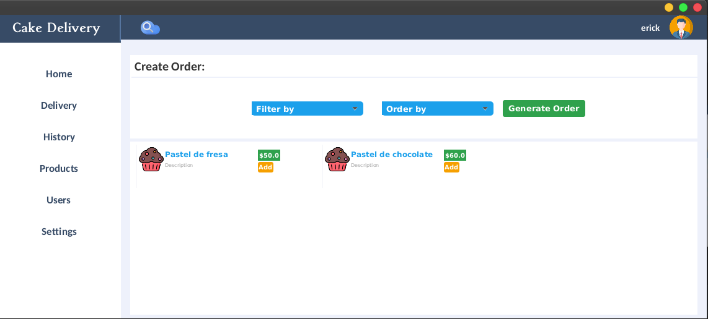

# App with Kotlin

### Requisitos

* Docker 19.0.0+
* Docker-Compose 1.2.0+
* Java - openjdk version "1.8.0"+
* Kotlin 1.4.0+

### Instalar DataBase
Posicionarse en el directorio del proyecto y 
ejecutar el comando:

> docker-compose up

Para cerrar el contenedor
> docker-compose down

### Ejecución del sistema en desarrollo
Primero debe descargar las dependencias del 
proyecto empleando gradlew.

Despues ejecute el archivo **Main.kt**

Para lograr entrar al sistema usar las siguientes credenciales:

> User: **erick@admin.com**
> 
> Pass: **admin**

### Generar datos de prueba 

Para poder testear el sistema, puede generar 
datos de prueba.

Configure en el archivo **Run.kt** con la cantidad de 
elementos que quiera generar con las factories.

Ejecute las fabricas ejecutando el archico **Run.kt**

    OJO: La DataBase posee Constraints Unique, para
         evitar que se repitan elementos con los 
         mismos datos. Asi que al crear elementos con
         datos repetidos ramdon puede retornar un error.

### Historial de Commits
El estandar que se empleo para llevar el historial 
de commits fue:

* FEACTURE: Se agrego una nueva caracteristica al sistema

* REFACTOR: No se agrego una nueva caracteristica pero el 
  sistema sufrio cambios en su estructura
  

* FIX: Se corrigio un error o bug en el sistema 

* DOC: Se modifico o actualizo la documentacion del sistema

### Preview Gif

### Preview Images

    Sistema de prueba aun no esta terminado. 

